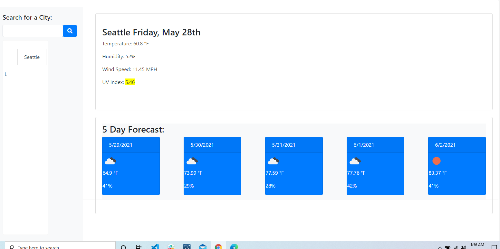

# weatherDashboard

## Description

- This app allows the user to search a city and look at the current weather forecast. The app has the ability to retain past searches and also displays a 5 day weather forcast to its user. Apart from that it also shows the current weather update for the day.

## Table of Contents

- [Usage](#Usage)
- [Installation](#Installation)

## Usage

- The client will be able to search and have a list of past searches
     

- The user will be able to input a city and it will be saved into the local storage
   

- When the user clicks the submit button the user will be able to see the weather of that day and they will also be able to see the next available 5 day forecast.

## Installation

1. Created html with jumbotron and each individual card for the weather forecast, styled with css.

2. layed out variables for city search, and the current city that you are searching.

3. there are individual functions for each of the main cards and containers in order too, search for city, save city, display city weather forecast, and five day weather forecast.

4. Fetched an individual API for updating weather forecast and daily forecast.

5. Fetched an API for individual searches for the cities that are being searched.

6. create a function for searching the city and saving it into local storage as well as adding it to the city list.

7. Add color warning to UV conditions in each of the weather section cards.

8. set up individual for loops for the 5-weather forecast days, and the city lists.

9. updating icon

